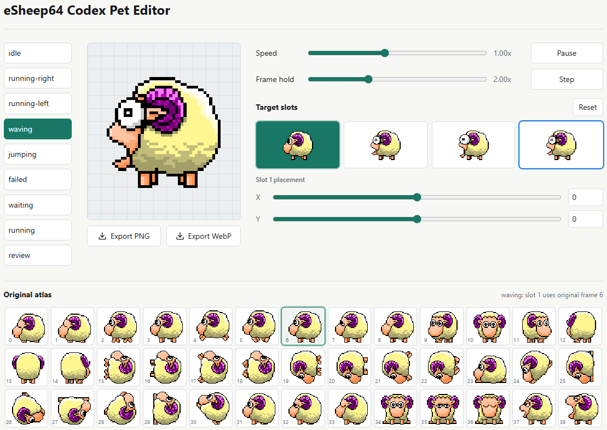

# eSheep64 Codex Pet

An eSheep64-inspired animated pet for Codex, with a small web editor for mapping
original eSheep64 source frames into a Codex-compatible spritesheet.

eSheep64 is a modern 64-bit recreation of eSheep / Stray Sheep, a 1995 Windows
screen mate that let a tiny sheep walk around, climb, fall, and interact with
desktop windows.

## Demo

https://github.com/user-attachments/assets/24c6d786-ace2-4a18-b55d-45692bc5338e

## Install

The ready-to-install pet bundle is in `bundle/`:

```text
bundle/
  pet.json
  spritesheet.webp
```

To install it, create `~/.codex/pets/esheep64` in your home directory and put
both bundle files there. The final folder should contain `pet.json` and
`spritesheet.webp`.

## Editor

Live editor: https://etechlead.github.io/esheep64-codex-pet/



```sh
npm install
npm run dev
```

The editor exports `spritesheet.webp` for final packaging.

## License

Code in this repository is licensed under the MIT License.

The eSheep64 sprite assets are derived from
[Adrianotiger/desktopPet](https://github.com/Adrianotiger/desktopPet). The
upstream eSheep64 page credits Adriano Petrucci as author and says the sprites
are from LiL_Stenly. Those assets are included for preservation and
compatibility with Codex pets; rights remain with their original authors.

See [NOTICE.md](NOTICE.md) for asset attribution.
